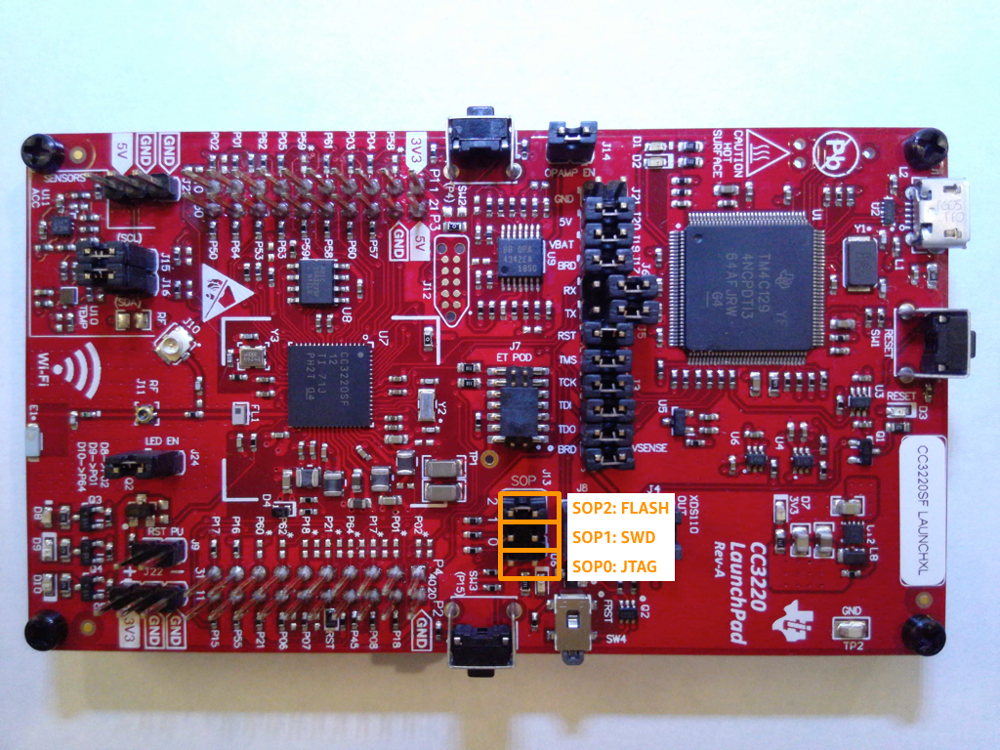
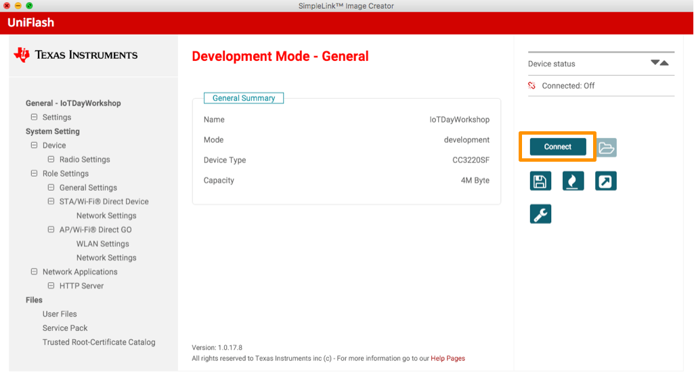
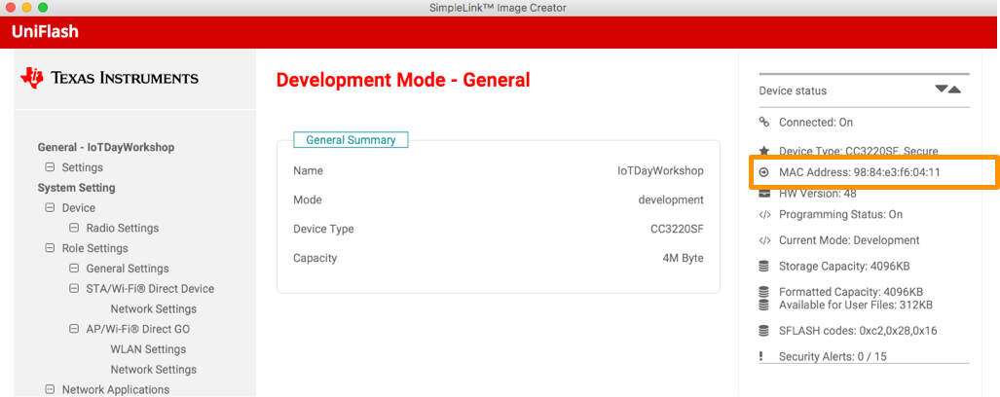
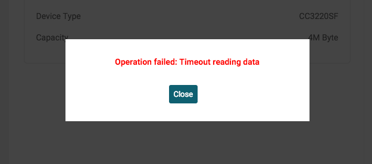

# Amazon FreeRTOS Workshop for the Texas Instruments CC3220SF
## Lab 1

Lab 1 will organize the development environment prerequisites onto your workstation.  These tools are required to not only successfully complete the labs but set the foundation for developing solutions on AWS with the Texas Instruments CC3220SF.

In this lab, you will accomplish the following:

1. Create an AWS Account and prepare credentials.
2. Install required software.
3. Prepare AWS IoT Core configuration objects and artifacts.

**Approximate time to completion**: 50 minutes

### Create an AWS Account

This lab, and all other labs, require an AWS account. To create an AWS Account, follow the instructions on the https://aws.amazon.com/premiumsupport/knowledge-center/create-and-activate-aws-account/ AWS website.

### Install Required Software


#### Texas Instruments Code Composer Studio

Texas Instruments Code Composer Studio 8 is required to complete the labs.

> USB Stick
> > 1. Insert the USB Memory Stick to your laptop.  If you are taking this lab outside from a sponsored AWS event, download the software from Texas Instruments.
> > 2. Locate the directory for your target platform. If you are running Windows, enter the ```windows``` directory.  If you are running MacOSX, enter the macosx directory.
> > Double-click the installer.
>
> Download
> > **NOTE** if you are at an AWS sponsored event and received the USB key, please do not download the payload from the internet.
> > 
> > 1. Navigate to the [TI Wiki](http://processors.wiki.ti.com/index.php/Download_CCS#Code_Composer_Studio_Version_8_Downloads).
> > 2. Download the ***offline installer*** installer for your target platform.
> > 3. Double-click the downloaded installer.

Windows: for install directory, leave default ```C:\ti```

For **Processor Support**, choose **SimpleLink(tm) Wi-Fi(R) CC32xx Wireless MCUs**.

#### Texas Instruments Uniflash

Texas Instruments Uniflash 4.4.0 is required to complete the labs.

> USB Stick
> > 1. Insert the USB Memory Stick to your laptop.  If you are taking this lab outside from a sponsored AWS event, download the software from Texas Instruments.
> > 2. Locate the directory for your target platform. If you are running Windows, enter the ```windows``` directory.  If you are running MacOSX, enter the macosx directory.
> > Double-click the installer.
>
> Download
> > **NOTE** if you are at an AWS sponsored event and received the USB key, please do not download the payload from the internet.
> > 
> > 1. Navigate to the [TI Uniflash Page](http://www.ti.com/tool/UNIFLASH).
> > 2. Download the ***offline installer*** installer for your target platform.
> > 3. Double-click the downloaded installer.

#### Python

Python is required for running AWS IoT test scripts and using the AWS CLI.

On Mac OSX, Python is already installed.

On Windows, Python may not already be installed on your system.

After Python installation, ensure that you install Pip and then the AWS CLI.

##### Installation

If you are using Mac OSX, continue to the next section.

TBD - windows installation and configuration instructions.


##### AWS CLI Installation and Configuration

Install the AWS CLI using ```pip```.

```shell
pip install awscli
```

Configure your credentials.

Run the following command to configure the AWS CLI.

```shell
aws configure
```

If you see output similar to the following, you can move to the next section since your AWS CLI configuration has already been configured.  You can press ```CTRL-C```.

```text
$ aws configure
AWS Access Key ID [****************UDXA]: 
```

You need to get AWS programmatic access credentials to configure the AWS CLI.

1. Login to the AWS Console.
2. Click Services > IAM.
3. Click Users.
4. Locate your user.
5. Generate Access and Secret Key.
6. Save the access and secret key locally.

Now, enter ```aws configure``` once more.  Enter the Access Key, Secret Key, Region (us-east-1), and format (json) when prompted. 


#### Git (recommended)

Git software is recommended but not required.  If you install and setup Git, you will be able to perform ```diff``` and ```status``` operations in the source tree that will help you understand what has changed in the source tree over time.

On Mac OSX, Git is already installed on your system.

For Windows, you have two choices for installing Git from Github.

* [Github Desktop](https://desktop.github.com/) - recommended for first time users
* [Git for Windows](https://gitforwindows.org/) - Most recommended (by author) for windows users, includes MINGW shell
* [SCM Git](https://git-scm.com/download/win) - recommended only for those who are experienced with git and have a pre-existing windows shell environment they are comfortable with.

### Registering Your Device

Throughout these Labs, the primary interface for working with the AWS Cloud is the command line.

The dominant reason for using the CLI is that most customers will want to automate these processes.  Command line and/or SDK awareness is essential.

From time to time visual confirmation may be an effective way to correlate CLI functions to what would be seen in the AWS Console. In such case, you may wish to login to the AWS Console to evaluate what the components look like or how they are organized.  However, the Labs do not lead through the steps to evaluating those objects.

*Also*, some learners may want to simply copy-paste CLI commands and code.  Although not disallowed, **it is strongly encouraged learners type in CLI commands and code**.  Otherwise, learning oversights may occur in performing the configuration and coding.

#### Identifying Your Device's Unique ID

There are a few ways of identifying a unique ID on a microcontroller based on what the MCU or relating peripherals are part of the device.  Some may choose using the MCU serial number, which is a number assigned to the microcontroller by the manufacturer.  In our case, we will use an identifier used with networked devices: the MAC address.

The MAC address composition that may be familiar to you has the format XX:XX:XX:XX:XX:XX.  However, we cannot use that format when creating AWS IoT things since the colon is not a supported character.

Another challenge is how to retrieve the MAC address when it's printed neither on the MCU nor the development board.  In this case, we can use Texas Instruments Uniflash.

1. Open the Uniflash utility.  For Mac OSX, it is located under Applications > ti > uniflash_4.3.0 > UniFlash 4.3.0.  For Windows, it is located under (TBD)
2. Move the SOP jumper to position 2.

   
3. Attach the CC3220SF board to your computer.

   
   1. Enter the Project Name IotDayWorkshop.
   2. Select CC3220SF.
   3. Select Development Mode
   4. Click Create Project.

7. Click the Connect button.
   
   
8. After connecting, you will be able to view device information.  Write down the MAC address for use in the next section.

   
9. If you see the following dialog box, ensure the SOP jumper is in the correct position (position 2).

   

**NOTE**: This project will be reused in Lab 5.  Do not delete the project.

#### Create the 'Thing' Virtual Devices.

In this step, you will create a Thing - an object representation of your device in the AWS IoT Core Device Registry.

In the previous section, you acquired the MAC Address of the device.  The Thing Name will be the MAC Address, but the colons need to be removed.

1. Open the Terminal or CMD window.
2. Set the variable for the Thing name.  If your MAC Address is ```98:84:e3:f6:04:11```, then your Thing Name will be ```9884e3f60411```.
3. To create the virtual device, issue the following command from the  *terminal window*:
   > Mac OSX
   > > ```bash
   > > THING_NAME=9884e3f60411
   > > aws iot create-thing --thing-name ${THING_NAME}
   > > ```
   >
   > Windows
   > > ```shell
   > > set THING_NAME=9884e3f60411
   > > aws iot create-thing --thing-name %THING_NAME%
   > > ```

4. The command line emits the Thing's ARN, which looks similar to the following:

   ```json
   {
      "thingArn": "arn:aws:iot:[YOUR_REGION]:[YOUR_ACCOUNT_ID]:thing/[YOUR_MAC_ADDRESS]",
      "thingName": "[YOUR_MAC_ADDRESS]"
   }
   ```

#### *Optional*: Verifying Thing Creation in the AWS Console 

1. Login to the AWS Console.
2. Select the Region that is defined in the AWS credential =configuration= file.
3. Click Services > IoT.
4. Click the Thing filter.
5. Manually identify that the Thing has been created.

#### Create the Device Certificate

In this step, you will create the certificates to authenticate your Thing with AWS IoT.  Although you can perform these steps using the AWS Console, customers will typically use the AWS CLI or API.

You will need to retrieve the [[https://www.symantec.com/content/en/us/enterprise/verisign/roots/VeriSign-Class%203-Public-Primary-Certification-Authority-G5.pem][Root CA Certificate]] from Symantec.

*WARNING*: When creating a new certificate with AWS IoT, the generated Public and Private keys can only be retrieved directly after creation.

When you authenticate with AWS IoT, the service receives the certificate and verifies that the certificate was signed with the private key to determine that the certificate is not falsified.

| File        | Purpose                                                            |
|-------------+--------------------------------------------------------------------|
| Private key | Used for signing the Certificate, represents your device identity. |
| Certificate | Authentication with AWS IoT (the Policy authorizes you)            |
| Public key  | Unused                                                             |
| Root CA     | AWS IoT endpoint verification                                      |

   

Using the Terminal Window, change directory to the certificate and key working directory.

> **Mac OSX**
> > ```bash
> > cd ${LAB_REPOPATH}
> > mkdir credentials
> > cd credentials
> > ```
>
> **Windows**
> > ```shell
> > cd %LAB_REPOPATH%
> > mkdir credentials
> > cd credentials
> > ```

Generate the client certificate and key.  This command is cross-platform.  The command will generate a lot of output.  There is one key output we require for future operation: the ```certificateArn``` property.  We can narrow the output using the ```--query``` flag.

> ```shell
> aws iot create-keys-and-certificate --set-as-active \
>     --certificate-pem-outfile    ${THING_NAME}_certificate.pem \
>     --public-key-outfile         ${THING_NAME}_public_key.pem  \
>     --private-key-outfile        ${THING_NAME}_private_key.pem \
>     --query certificateArn
> ```

Download the Root CA.

```shell
wget -O rootca.pem \
     https://www.symantec.com/content/en/us/enterprise/verisign/roots/VeriSign-Class%203-Public-Primary-Certification-Authority-G5.pem
popd
```

At the top of the output, locate the =certificateArn= property. Copy the value, which has a pattern of ```arn:aws:iot:<region>:<accountId>:cert/<certificateId>```. You will use this value when you attach the Policy to the Certificate.  It will look similar to the following:

```json
{
    "certificateArn": "arn:aws:iot:us-east-1:012345678910:cert/8530c605d209a17917da34e5516c452a782e1dddb4dcdadc6d4fb742504d146b",
```

For ease of use later in this module, you may wish to set this to an environment variable:

```bash
CERTIFICATE_ARN=arn:aws:iot:us-east-1:012345678910:cert/8530c605d209a17917da34e5516c452a782e1dddb4dcdadc6d4fb742504d146b
```

#### Create the Gateway's Policy

In this step, you will setup a policy to grant appropriate permissions for your Thing when authenticating with the Certificate.

Create the policy file on the device.

```shell
vi ${THING_NAME}_policy.json
```

Enter the following AWS IoT policy.  This policy allows the authenticated Thing to perform any action on any MQTT topic.

```json
{
  "Version": "2012-10-17",
  "Statement": [{
    "Effect": "Allow",
    "Action":["iot:*"],
    "Resource": ["*"]
  }]
}
```

Set the Policy name.

```bash
POLICY_NAME=${THING_NAME}_Policy
```

Create the AWS IoT policy.

```bash
aws iot create-policy \
    --policy-name ${THING_NAME}_Policy \
    --policy-document file://${THING_NAME}_policy.json
```

#### Associate the Thing and Policy to Certificate

Associate the Thing and Policy with the Certificate.  Multiple Policies and Things can be attached to the Certificate, but this is typically considered an insecure configuration since multiple Things would connect with the same Client Certificate, and if the private  key becomes compromized /all Things would become compromised/.

Use the following command line to associate the Thing to the Certificate.

> Mac OSX
> > ```bash
> > aws iot attach-thing-principal       \
> >         --thing-name $THING_NAME     \
> >         --principal $CERTIFICATE_ARN
> > ```
> 
> Windows
> > ```shell
> > aws iot attach-thing-principal^
> >     --thing-name %THING_NAME%^
> >     --principal %CERTIFICATE_ARN%
> > ```

Use the following command line to associate the Policy to the Certificate.

> Mac OSX
> > ```bash
> > aws iot attach-principal-policy \
> >     --policy-name $POLICY_NAME    \
> >     --principal $CERTIFICATE_ARN
> > ```
>
> Windows
> > ```shell
> > aws iot attach-principal-policy^
> >     --policy-name %POLICY_NAME%^
> >     --principal %CERTIFICATE_ARN%
> > ```


At this point, when the client code makes a connection using the Client certificate, theit will be able to perform all AWS IoT actions.

### Outcomes

In this lab, you learned about the software needed to build solutions on top of AWS with the Texas Instruments CC3220SF.  Also, you learned about the AWS IoT Core objects needed to make a successful connection.

In the next lab, you will learn about how to make the connection successful using these objects and understand the basic Amazon FreeRTOS framework.  

[Next Lab](./Lab2.md)